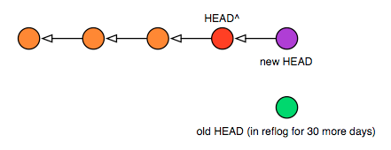

# Doing a soft reset

If you use the `--soft` option to `reset`, this is the same as simply changing your HEAD reference to a different commit. Your working tree changes are left untouched. This means the following two commands are equivalent:

```bash
$ git reset --soft HEAD^     # backup HEAD to its parent,
                             # effectively ignoring the last commit
$ git update-ref HEAD HEAD^  # does the same thing, albeit manually
```

In both cases, your working tree now sits on top of an older HEAD, so you should see more changes if you run `status`. It’s not that your files have been changed, simply that they are now being compared against an older version. It can give you a chance to create a new commit in place of the old one. In fact, if the commit you want to change is the most recent one checked in, you can use `commit --amend` to add your latest changes to the last commit as if you’d done them together.

But please note: if you have downstream consumers, and they’ve done work on top of your previous head — the one you threw away — changing HEAD like this will force a merge to happen automatically after their next pull. Below is what your tree would look like after a soft reset and a new commit:



And here’s what your consumer’s HEAD would look like after they pulled again, with colors to show how the various commits match up:


